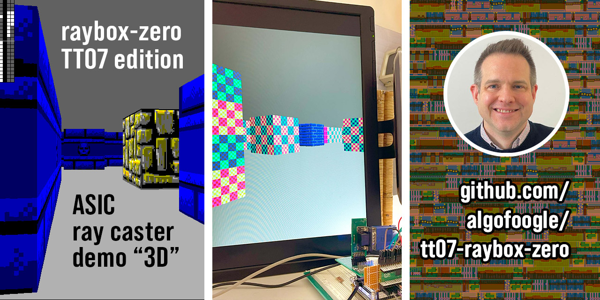

<!---

This file is used to generate your project datasheet. Please fill in the information below and delete any unused
sections.

You can also include images in this folder and reference them in the markdown. Each image must be less than
512 kb in size, and the combined size of all images must be less than 1 MB.
-->

## How it works

This is a framebuffer-less VGA display generator (i.e. it is 'racing the beam') that produces a simple
implementation of a "3D"-like ray casting game engine... just the graphics part of it.
It is inspired by Wolfenstein 3D, using a map that is a grid of wall blocks, with basic texture mapping.

There is nothing yet but textured walls, and flat-coloured floor and ceiling. No doors or sprites, sorry.
Maybe that will come in a future version (stay tuned for TT08 or some later release, maybe?)

The 'player' POV ("point of view") is controlled by SPI, which can be used to write the player position,
facing X/Y vector, and viewplane X/Y vector in one go.

NOTE: To optimise the design and make it work without a framebuffer, this renders what is effectively a
portrait view, rotated. A portrait monitor (i.e. one rotated 90 degrees anti-clockwise) will display this
like the conventional first-person shooter view, but it could still be used in a conventional landscape
orientation if you imagine it is for a game where you have a first-person perspective of a flat 2D
platformer, endless runner, "Descent-style" game, whatever.

NOTE: This is a resubmission of an updated version of what originally went to TT04. While the TT04 version used 4x2 tiles, this TT07 version adds some new features (namely the option for an external SPI texture ROM), and so uses 6x2 tiles (which is about 0.25mm2). The opportunity to do this was largely supported by Uri Shaked and Matt Venn of [Tiny Tapeout](https://tinytapeout.com), who graciously offered a resubmission after it was found that the TT04 version had suffered from a synthesis bug in an older version of OpenLane, which led to severe glitches in the rendering (due to an unintended alteration of the logic).

TBC. Please contact me if you want to know something in particular and I'll put it into the documentation!

## How to test

TBC. Please contact me if you want to know something in particular and I'll put it into the documentation!

Supply a clock in the range of 21-31.5MHz; 25.175MHz is ideal because this is meant to be "standard" VGA 640x480@59.94Hz.

Start with `gen_tex` set high, to use internally-generated textures. You can optionally attach an external QSPI memory (`tex_...`) for texture data instead, and then set `gen_tex` low to use it.

`debug` can be asserted to show current state of POV (point-of-view) registers, which might come in handy
when trying to debug SPI writes.

If `reg` input is high, VGA outputs are registered. Otherwise, they are just as they come out of internal combo logic.
I've done it this way so I can test the difference (if any).

`inc_px` and `inc_py` can be set high to continuously increment their respective player X/Y position register.
Normally the registers should be updated via SPI, but this allows someone to at least see a demo in action
without having to implement the SPI host controller. NOTE: Using either of these will suspend POV updates via SPI.

The "SPI2" ports (`reg_sclk`, etc.) are for access to all other registers that we can play with.
I decided to keep these separate because I implemented them very late, and didn't want to break the
existing SPI interface for POV register access.

## External hardware

Tiny VGA PMOD on dedicated outputs (`uo`).

Optional SPI controllers to drive `ui_in[2:0]` (point-of-view aka vectors) and `uio_in[4:2]` (other control/display registers).

Optional external SPI ROM for textures.

TBC. Please contact me if you want to know something in particular and I'll put it into the documentation!
