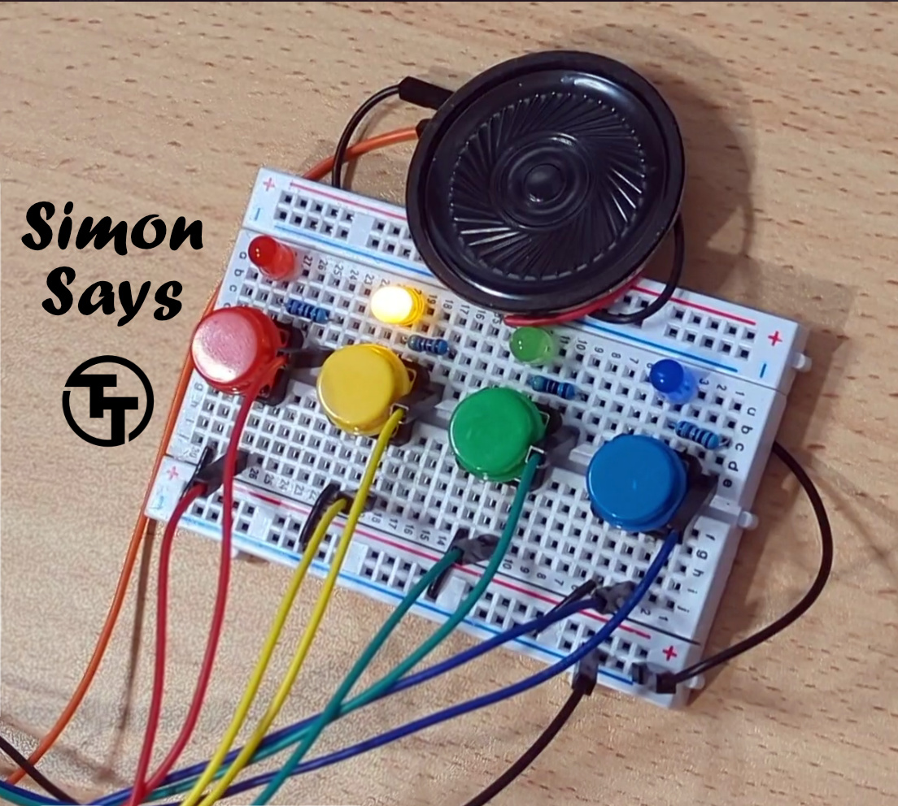

## How it works

Simon says is a simple electronic memory game: the user has to repeat a growing sequence of colors.
The sequence is displayed by lighting up the LEDs. Each color also has a corresponding tone.

In each turn, the game will play the sequence, and then wait for the user to repeat the sequence
by pressing the buttons according to the color sequence.
If the user repeated the sequence correctly, the game will play a "leveling-up" sound,
add a new color at the end of the sequence, and move to the next turn.

The game continues until the user has made a mistake. Then a game over sound is played, and the game restarts.

Check out the online simulation at https://wokwi.com/projects/397436605640509441 (including wiring diagram).

## How to test

Use a [Simon Says Pmod](https://github.com/urish/tt-simon-pmod) to test the game.

Provide a 50 KHz clock input, reset the game, and enjoy!

If you don't have the Pmod, you can still connect the hardware manually as follows:

1. Connect the four push buttons to pins `btn1`, `btn2`, `btn3`, and `btn4`.
   Also connect each button to a pull down resistor.
2. Connect the LEDs to pins `led1`, `led2`, `led3`, and `led4`, matching
   the colors of the buttons (so `led1` and `btn1` have the same color, etc.).
   Don't forget current-limiting resistors!
3. Connect the speaker to the `speaker` pin (optional).
4. Connect the seven segment display as follows: `seg_a` through `sev_g` to
   individual segments, `dig1` to the common pin of the tens digit, `dig2`
   to the common pin of the ones digit.
   Set `seginv` according to the type of 7 segment display you have: high
   for common anode, low for common cathode.
5. Reset the game, and then press any button to start it. Enjoy!

## External Hardware

[Simon Says Pmod](https://github.com/urish/tt-simon-pmod) or four push buttons (with pull-down resistors), four LEDs, and optionally a speaker/buzzer and two digit 7-segment display.
